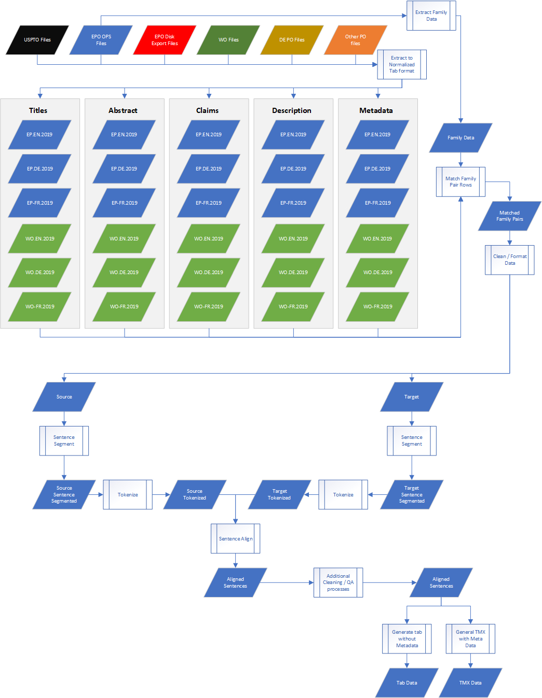

# EuroPat
## Table of Contents
- [Introduction](#introduction)
  - [Data Sources](#data-sources)
  - [Kind Codes](#kind-codes)
  - [File Naming Convention](#file-naming-convention)
  - [Normalized Tab Format](#normalized-tab-format)
- [Workflow Overview](#workflow-overview)
  - [Data Preparation](#data-preparation)
  - [Family Data](#family-data)
  - [Processing](#processing)
- [Installation](#installation)
- [FAQ](#FAQ)

----
## Introduction
The EuroPat project collects, processes and aligns patent data from multiple patent offices (i.e. USPTO and EPO) to create parallel corpora. The source set of data may be in a different patent office from the target set of data and each set of data is in multiple formats even within the same patent office. 

The code in this project normalizes the data, performs the necessary lookups needed to match and cross reference the files and then further formats and processes the data ready for alignment. The last stage is to align the data. 

## Data Sources
USPTO direct data comes from https://bulkdata.uspto.gov/ in the section “Patent Grant Full Text Data (No Images) (JAN 1976 - PRESENT)” and is free to download.
EPO data comes from a purchase set of data stored on Valhalla at University of Edinburgh.

## Kind Codes
Bulk data is classified by a Kind Code.

USPTO Kind Codes: https://www.uspto.gov/learning-and-resources/support-centers/electronic-business-center/kind-codes-included-uspto-patent
EPO Kind Codes: https://worldwide.espacenet.com/help?locale=en_EP&method=handleHelpTopic&topic=kindcodes

For Phase 1, we are processing Grants and their associated Kind Codes.

## File Naming Convention
```sh
<source>-<lang>-<year>-<section>.tab
```

Examples:
```sh
USPTO-EN-2019-meta.tab		All relevant meta data such as IPC, dates etc.
USPTO-EN-2019-title.tab		Titles only
USPTO-EN-2019-abstract.tab	Abstracts only
USPTO-EN-2019-claim.tab		Claims only
USPTO-EN-2019-desc.tab		Description only

EP-EN-2019-meta.tab
EP-EN-2019-title.tab		
EP-EN-2019-abstract.tab	
EP-EN-2019-claim.tab		
EP-EN-2019-desc.tab		
EP-DE-2019-meta.tab
EP-DE-2019-title.tab		
EP-DE-2019-abstract.tab	
EP-DE-2019-claim.tab		
EP-DE-2019-desc.tab		
```
## Normalized Tab Format
Data comes from many sources and is in multiple formats even within the same source. A normalized tab format file is created for all data so that it can then be processed with one set of tools for the remainder of the tasks. Each patent is compacted onto a single line and merged into a larger file by year.

All data files except for meta type have the following base format per line:
```sh
<doc id><tab><date><tab><other data>
```

Examples:
```sh
US-10174136-B2	20190108	Methods for making a plurality of nanoparticles are provided. The method may include flowing a first component of the core into a reaction chamber; flowing a polymeric material into the reaction chamber; and flowing a second component of the core into the reaction chamber such that the first component reacts with the second component to form a core. The polymeric material forms a polymeric shell around the core.
US-10174150-B2	20190108	A one-part moisture-curing liquid-applied waterproofing membrane as disclosed includes a polyurethane polymer obtained from at least one polyether polyol and at least one diisocyanate, and an aldimine of the formula (I). The membrane has a long shelf life stability with both aromatic and aliphatic isocyanates, a low viscosity at low solvent content, a sufficiently long open time to allow hand application and cures fast to a solid elastic material of high strength and high elongation. The released aldehyde is non-toxic and low flammable and evaporates quickly out of the membrane causing only minimal odor emission. The membrane has high crack-bridging qualities in a broad temperature range and is easily overcoatable without interlayer adhesion problems, which makes it particularly suitable for roofing applications.
US-10174151-B2	20190108	The present invention relates to a method for producing polyether carbonate polyols, wherein: (i) in a first step, (a) carbon dioxide and propylene oxide or (b) carbon dioxide and a mixture of propylene oxide and at least one further alkylene oxide in a ratio by weight of &#x3e;90:10 are attached to one or more H-functional starting substances in the presence of at least one DMC catalyst; (ii) in a second step, the reaction mixture obtained from step (i) is (ii-1) first chain-lengthened with a mixture containing propylene oxide (PO) and ethylene oxide (EO) in a PO/EO ratio by weight of 90/10 to 20/80 in the presence of at least one DMC catalyst.

```

## Workflow Overview
### Data Preparation
* Convert the USPTO data into the normalized tab format above.
* Convert the EPO data into the normalized tab format above.

### Family Data
* Using the EPO data scan the list of XML files to extract a list of unique IDs.
* Call the EPO OPS API to get the family data for each unique ID and store the data in a database table.
For each datasource (USPTO, EPO, etc.) load the list of pre-formatted tab data with their IDs into the database (not the full data, just the IDs)
* Produce a list of paired datasets by language.

### Processing
* Extract the paired sections into a tab file by language pair
* Clean the data and prepare it for sentence alignment
* Extract to individual files with a paired ID
* Sentence Segment
* Tokenize
* Align





## Installation

## FAQ